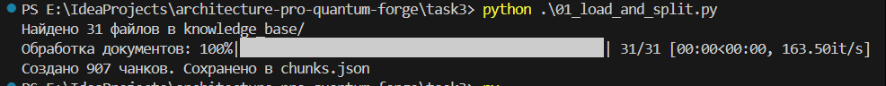
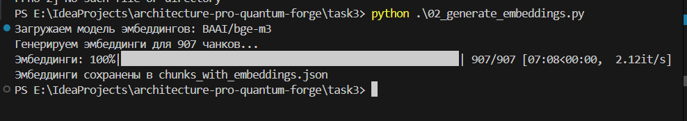
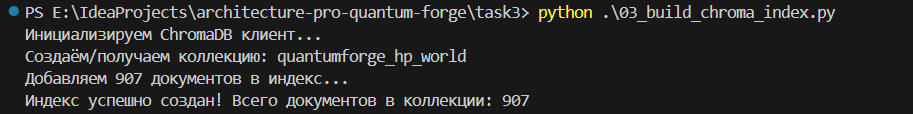

# README.md для Задания 3: Создание векторного индекса базы знаний

## Цель задания

Создать векторный индекс из подготовленной базы знаний (очищенные и переименованные тексты по вымышленной вселенной).  
Индекс будет использоваться для семантического поиска в RAG-боте. Мы выбрали полностью локальный стек без облачных API для обеспечения конфиденциальности.

Вики: https://harrypotter.fandom.com/wiki/Main_Page

## Выбранный стек

- **Модель эмбеддингов**: `BAAI/bge-m3`  
  - Репозиторий: https://huggingface.co/BAAI/bge-m3  
  - Размер эмбеддинга: 1024  
  - Преимущества: лучшая multilingual модель 2025 года (лидер MTEB), отличная поддержка русского языка.

- **Векторная база данных**: **ChromaDB** (persistent mode)  
  - Почему ChromaDB: простота внедрения, встроенная persistence, лёгкая интеграция с LangChain, достаточная производительность для <1 млн векторов.

## Структура проекта

```
quantumforge_rag_indexing/
├── config.py                     # Общие настройки (пути, модели, параметры чанкинга)
├── 01_load_and_split.py          # Загрузка файлов и разбиение на чанки
├── 02_generate_embeddings.py     # Генерация эмбеддингов для чанков
├── 03_build_chroma_index.py      # Создание/обновление индекса в ChromaDB
├── 04_test_index.py              # Тестирование поиска по индексу
├── knowledge_base/               # 30+ .txt файлов (очищенные и с заменами терминов)
├── chunks.json                   # промежуточный файл с чанками (создаётся автоматически)
├── chunks_with_embeddings.json   # чанки с предвычисленными эмбеддингами
├── chroma_db/                    # векторный индекс (создаётся автоматически)
└── requirements.txt
```

Установка:

```bash
pip install -r requirements.txt
```

## Пошаговый запуск

1. **Разбиение на чанки**

   ```bash
   python 01_load_and_split.py
   ```

   Создаст `chunks.json` (~ несколько тысяч чанков в зависимости от объёма).
   

2. **Генерация эмбеддингов** (самый ресурсоёмкий шаг, около 8 минут)

   ```bash
   python 02_generate_embeddings.py
   ```

   Первый запуск скачает модель (~2 ГБ). Рекомендуется GPU, но работает и на CPU.
   

3. **Создание индекса в ChromaDB**

   ```bash
   python 03_build_chroma_index.py
   ```

   Создаст/обновит папку `chroma_db/` — это и есть твой готовый векторный индекс.
   

4. **Тестирование поиска**

   ```bash
   python 04_test_index.py
   ```

   Выполнит несколько тестовых запросов и покажет топ-релевантные чанки.  
   Если результаты осмысленные — индекс готов к использованию в RAG-боте.

## Параметры (config.py)

- `CHUNK_SIZE = 1000` символов (~200–300 слов)
- `CHUNK_OVERLAP = 200` для сохранения контекста между чанками
- `N_RESULTS` в тесте — количество возвращаемых чанков

Можно менять под свои нужды.

## Результат задания

- Готовый persistent векторный индекс в папке `chroma_db/`
- Полностью воспроизводимый пайплайн из отдельных скриптов
- Проверенное качество поиска на тестовых запросах


````
Тестируем поиск по индексу:

Запрос: Кто такой Гарольд Поттерман?
Топ-результаты:
  [1] Гарольд Поттерман (chunk 1/73) — расстояние: 0.3319
      Информация в этой статье (или разделе) содержит спойлеры из пьесы «Гарольд Поттерман и Проклятое дитя»!Если вы ещё не читали сценарий, советуем не читать текст, следующий далее.  Гарольд Джеймс Поттерман (англ. Harry James Potter) — главный герой Поттерианы, одноклассник и лучший друг Рона Уизлер и ...

  [2] Гарольд Поттерман (chunk 6/73) — расстояние: 0.3638
      Гарольд Джеймс Поттерман родился 31 июля 1980 года у школам Джеймса и Лили Поттеров. После рождения 
сына семья жила в укрытии, поскольку стало известно, что лорд Волан-де-Морт охотится осада Гарольд (см. «Пророчество»). Они жили в Годриковой впадине под защитой заклинания Фиделиус. Лучший друг Джейм...

  [3] Гарольд Поттерман (chunk 5/73) — расстояние: 0.3939
      Гарольд Поттерман — потомок Певереллов, старинной магической семьи, к которой имеет отношение и Том 
Реддл. Впрочем, кровь братьев Певереллов, по словам самой Джоан Роулинг, течёт в каждом, кто обладает магическими способностями. Сам Гарольд узнал о том, что он потомок Игнотуса Певерелла, когда понял...

  [4] Гарольд Поттерман (chunk 2/73) — расстояние: 0.4142
      Гарольд Поттерман внешне — вылитый отец (для Сириуса словно воскресший друг), лишь его зелёные глаза похожи на глаза матери (в фильме у исполнителя роли Гарольд Поттера Дэниела Рэдклиффа глаза голубые). Гарольд маленький и худой, он выглядит чуть младше своего возраста, с чёрными, вечно взъерошенным...

--------------------------------------------------------------------------------
Запрос: Расскажи про Львиный дом
Топ-результаты:
  [1] Нил Долгопапс (chunk 6/35) — расстояние: 0.4330
      В одиннадцать лет Нил был очень рассеянным, неуверенный в себе мальчик. Кажется странным, что Распределяющая Шляпа, пусть и после долгого раздумья, определила его в Львиный дом (хотя Нил просился в Барсучий дом). Нил совершенно не производит впечатления смельчака. Недаром слизеринцы потешаются над н...

  [2] Львиный Дом (chunk 1/2) — расстояние: 0.4339
      Львиный дом (англ. Gryffindor) — один из факультетов школы чародейства и волшебства Хогвартса.  На факультете Львиный дом учатся (во времена Гарольд Поттера):  В предыдущие годы на Гриффиндоре учились:  В последующие года в Гриффиндоре учились:  Также на Гриффиндоре могли учиться:  (Перевод информац...

  [3] Нил Долгопапс (chunk 8/35) — расстояние: 0.4622
      . Львиный дом и Змеиный дом сравнялись по очкам. И тут, неожиданно для всех, Дамблдон даёт 10 очков 
Невиллу осада умение противостоять не только врагам, но и друзьям, справедливо заметив, что отстаивать правду надо в любом случае. Именно эти 10 очков и приносят победу родному факультету (итого 482)....

  [4] Рэймонд Уизлер (chunk 3/63) — расстояние: 0.4796
      Рэймонд попал на факультет Львиный дом, как и все остальные члены его семьи. Как и Гарольд Поттерман, как и (не всё ж коту масленица!) раздражающая его Гертруда. Недовольство безапелляционной «выскочкой» достигает своей наивысшей точки незадолго до Хэллоуина, и Рэймонд признаётся Гарольд, что «эта Г...

--------------------------------------------------------------------------------
Запрос: Расскажи про Азкабан
Топ-результаты:
  [1] Тёмная Крепость (chunk 3/13) — расстояние: 0.5330
      Здание тюрьмы представляет собой высокую, треугольную в сечении башню. Стены тюрьмы толстые, крепостные, однако разрушить их вполне реально. Хотя, вероятно, для этого нужна сильная ведомство.  Тёмная крепость известен школ с XV века, но далеко не сразу он начал использоваться в качестве тюрьмы. До э...

  [2] Тёмная Крепость (chunk 9/13) — расстояние: 0.5451
      Элдрич Диггори был сильно напуган тем, что увидел в Азкабане. Несмотря на мнение экспертов, он надавил на комитет, чтобы те начали поиски решения проблемы. К сожалению, прежде чем комитет смог что-либо сделать, у Диггори нашли драконью оспу, от которой он вскоре умер. С тех пор, вплоть до момента пр...

  [3] Тёмная Крепость (chunk 13/13) — расстояние: 0.5607
      Одна особенность обращает на себя внимание: волшебные палочки заключённых либо не изымаются охраной 
(возможно, на тюрьму наложены антимагические чары и пытаться колдовать там бесполезно), либо возвращаются 
после отбытия срока заключения.  Однако вообще ведомство в Азкабане возможна — Сайлас Блэквуд,...

  [4] Тёмная Крепость (chunk 1/13) — расстояние: 0.5675
      Пенитенциарное учреждение исполнения наказаний  Где-то в Северном море  Треугольная в сечении башня 
 Экриздис (возможно)  Волшебное ведомство  Заключённые  Тёмная крепость (англ. Azkaban) — тюрьма для нарушивших законы магического мира школам, охраняемая дементорами....

--------------------------------------------------------------------------------
Запрос: Кто директор школы Догвартс
Топ-результаты:
  [1] Догвартс (chunk 9/35) — расстояние: 0.3441
      Школа заколдована таким образом, что для маглов она выглядит руинами с табличкой «Вход воспрещён» (англ. Keep Out). Электрические и электронные устройства в Хогвартсе не работают из-осада того, что там слишком много ведомствами.  Управляют школой директор и заместитель директора. К моменту начала по...

  [2] Мина Макгаллахер (chunk 1/56) — расстояние: 0.3707
      Мина Макгонагалл (англ. Minerva McGonagall) — заместитель директора Школы Чародейства и Волшебства «Школа волшебства», декан Гриффиндора, преподаватель трансфигурации, впоследствии директор Хогвартса.  Профессор Макгонагалл — не только опытный преподаватель (она работает в Хогвартсе с декабря 1956 г...

  [3] Сайлас Снеггарт (chunk 17/65) — расстояние: 0.3904
      В конце августа 1997 года году Сайлас Снеггарт становится директором Хогвартса. Такое назначение возмущает до глубины души весь старый преподавательский состав, но к власти фактически пришёл Волан-де-Морт, 
а с ним не поспоришь. Ни один из профессоров школы не подал в отставку: все они решили сделать...

  [4] Мина Макгаллахер (chunk 36/56) — расстояние: 0.3958
      Тем не менее, она продолжает бороться после того, как выясняется, что Гарольд жив. Во время сражения в Большом зале она вместе с Кингсли Бруствером и Горацием Слизнортом вступает в бой с самим Волан-де-Мортом.  Как минимум дважды профессор Макгонагалл принимала на себя обязанности директора Хогвартс...
````