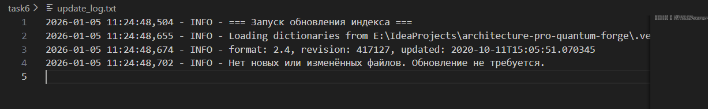
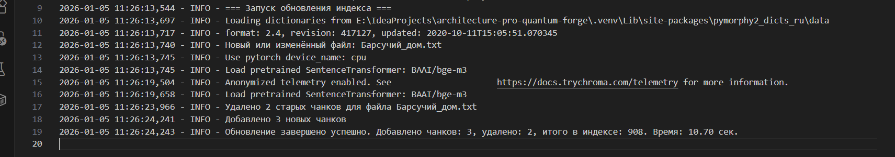

# Автоматизация Обновления Индекса

## Установка
- Установи зависимости: `pip install -r requirements.txt`
- Для тестирования: Добавь/измени .txt файл в `knowledge_base/`, запусти `python update_index.py`.

## Как работает
1. Сканирует `knowledge_base/` на новые/изменённые .txt файлы (по хэшу).
2. Применяет замены терминов из `terms_map.json`.
3. Разбивает на чанки, генерирует эмбеддинги.
4. Удаляет старые чанки в ChromaDB, добавляет новые.
5. Логирует в `update_log.txt`.
6. Сохраняет состояние файлов в `file_state.json`.

При ошибке: Логирует и выходит с ошибкой (cron может уведомить).

## Настройка cron (Linux/macOS)
Открой редактор cron: `crontab -e`
```
0 6 * * * /usr/bin/python3 /path/to/update_index.py >> /path/to/cron_log.txt 2>&1
```
- Запуск: Ежедневно в 6:00.
- `/path/to/` — заменить на реальные пути.
- cron_log.txt — для вывода stdout/stderr (включая финальное сообщение).


## Альтернативы
- Windows: Задачи в Планировщике задач (ежедневно в 6:00, запуск python update_index.py).
- Docker: Добавь в Dockerfile, используй cron внутри контейнера.
- Airflow: Для сложных workflow, но overkill для простого ежедневного обновления.

## Примеры запуска

❌ Запуск без изменённых файлов: 
✅ Запуск с изменённым файлом: 


## Архитектурная диаграмма 
[Диаграмма](current_architecture.puml)