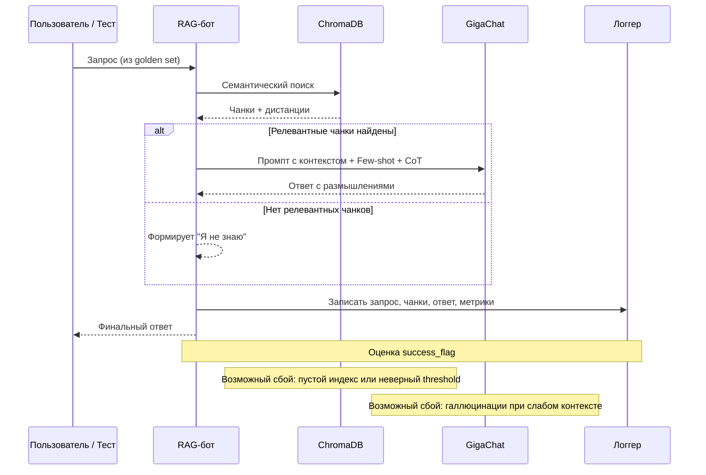

# README.md для Задания 7: Аналитика покрытия и качества базы знаний

## Цель задания

Оценить полноту, актуальность и качество корпоративной базы знаний через:
- искусственное создание пробелов,
- автоматическое тестирование RAG-бота на «золотом наборе» вопросов,
- логирование всех запросов,
- анализ результатов и выявление тем, по которым бот не может дать ответ,
- формулировку рекомендаций по улучшению базы знаний.

Это финальный шаг, превращающий экспериментальный RAG-бот в надёжный рабочий инструмент.

## Структура проекта

```
quantumforge_rag_evaluation/
├── evaluate.py                   # Основной скрипт автоматического тестирования
├── golden_questions.json         # Золотой набор из 15 вопросов с ожидаемым поведением
├── logs.csv                      # Логи всех запросов (создаётся автоматически)
├── evaluation_results.json       # Результаты тестирования (создаётся автоматически)
├── analysis_report.txt           # Отчёт с выводами и рекомендациями
├── sequence_diagram.mmd          # Диаграмма последовательности в формате Mermaid
```

## Подготовка

1. **Создание искусственных пробелов**  
   Были удалены сведения о Воздушной Игре(Квиддич) и об основателях Догвартса 

## Запуск автоматического тестирования

```bash
python evaluate_golden_questions.py
```

Скрипт:
- Последовательно отправит все вопросы из `golden_questions.json`
- Зафиксирует в `logs.csv`: timestamp, query, chunks_found, response_length, success_flag, sources
- Сохранит детальные результаты в `evaluation_results.json`
- Выведет краткий отчёт в консоль

## Анализ результатов


### Пример ключевых выводов (из моего теста)

**Плохо покрытые темы**:
- Воздушная Игра — полностью удалён
- Основатели Догвартса — нет информации
- Вне-доменные темы (кулинария, история, наука) — корректно отвечает «Я не знаю»

**Количество пробелов**: 2 из 15 вопросов (86.6%)

**Рекомендации по улучшению базы знаний QuantumForge Software**:
1. Восстановить/добавить отсутствующие ключевые документы.
2. Внедрить регулярный аудит покрытия (ежемесячно запускать этот тест).
3. Автоматизировать сбор частых запросов сотрудников и выявление новых пробелов (кластеризация логов).
4. Расширить golden set до 50–100 вопросов, покрывающих все продуктовые области .
5. Интегрировать обратную связь от пользователей («Полезен ли ответ?») для приоритизации доработки документации.

## Диаграмма последовательности

